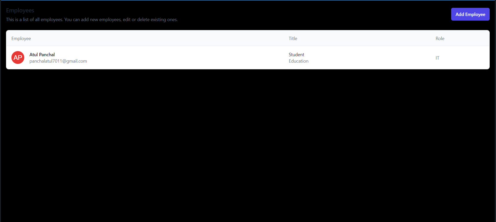

# Login_Form
## Screenshots
Home Page

Login In Page

Collection of Data

## Technologies Stack:

### Components
- Node.js,MongoDB,Express.js,EJS
- Javascript,AJAX,jquery
- HTML,React.js. 
- Tailwind,Css
- Nodemailer
- Mongodb atlas database the cloud native database
- MongoStore

### Insights
- passport-jwt strategy for authentication and authorization.
- passport-google-oauth2 strategy for social authentication through google.
- used Nodemailer to send out emails on different events.
- used morgan to make production logs
- separate environment for development and production
- Api's calls.

### How to install
- Clone the project onto your local machine.
- Then cd Login_Form
- globally install and set mongodb
- npm install to install dependencies
- globally install nodemon
- nodemon index.js (run server in development mode)
- Visit your app at http://localhost:3000

### Settings for Mailer and Google Sign In
- Go to environment file in config
- Add your Gmail id and password to use it to send invite mails
- Add Google Oauth 2 credentials for google sign in/up
- Add a compass to an AWS Cloud environment and store login form data.
